## [(Back) Ubuntu Server 22.04.1 LTS](./Ubuntu%20Server%2022.04.1%20LTS.md)
#### 1.Create VM in Oracle vm virtualbox
1.1 กดปุ่ม New

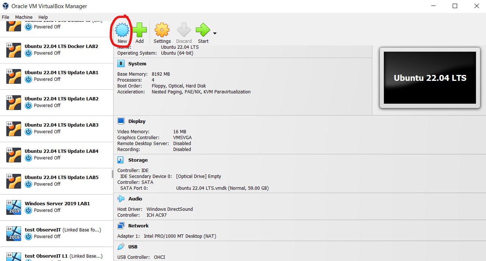

1.2 กำหนดชื่อ VM และประเภท OS ที่ต้องการ

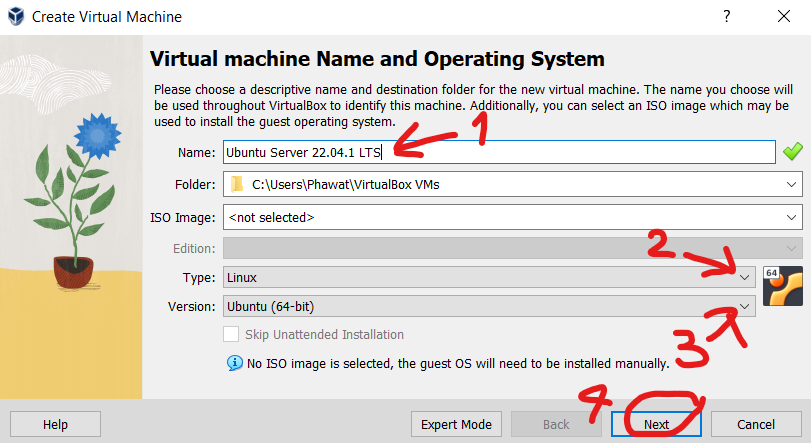

1.3 กำหนด RAM และ Hard Disk ที่ต้องการ

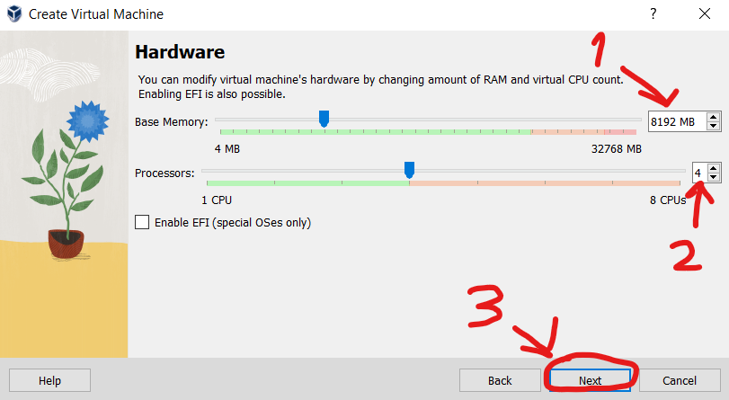

1.4 กำหนด Hard Disk ที่ต้องการ

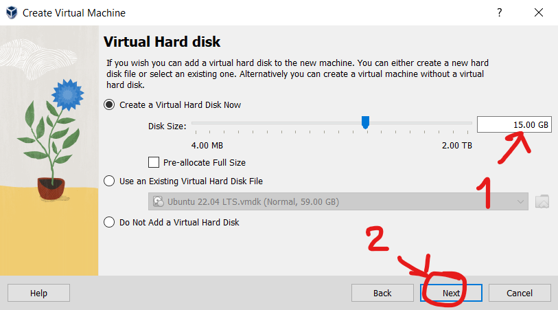

1.5 กดปุ่ม Finish เพื่อสร้าง VM ใหม่

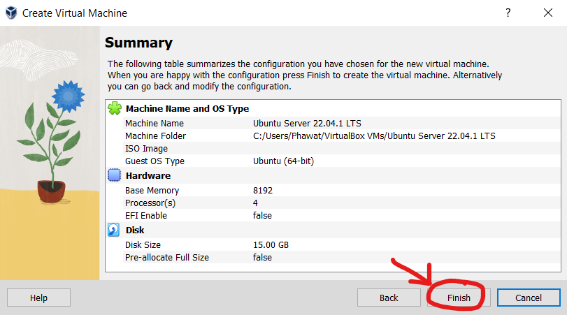

#### 2.ตั้งค่า VM ใหม่ หรือ เครื่องที่สร้าง
2.1 กดเข้าตั้งค่า

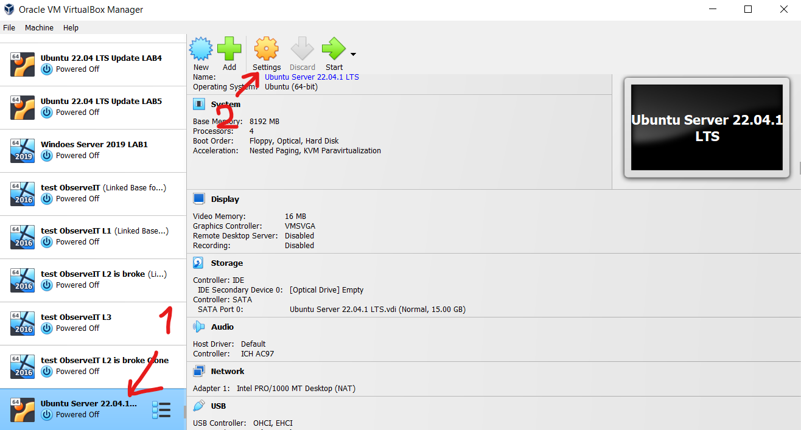

2.2 กดเข้าไปที่ menu system

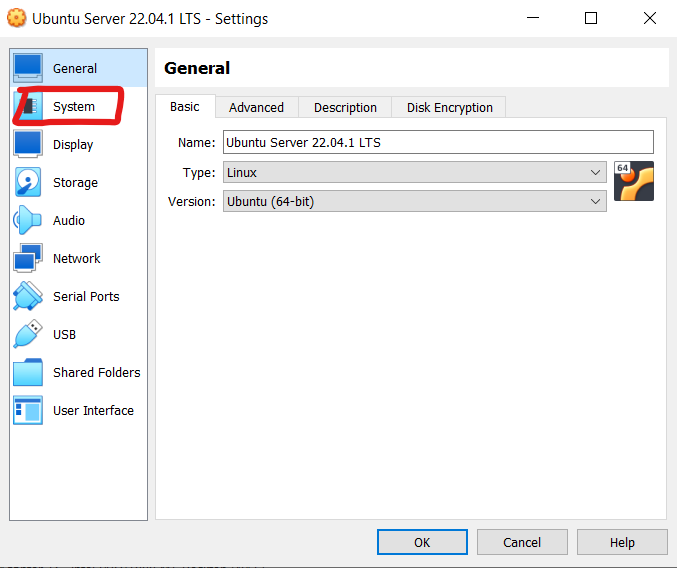

2.3 กดเข้าไปที่ menu processor

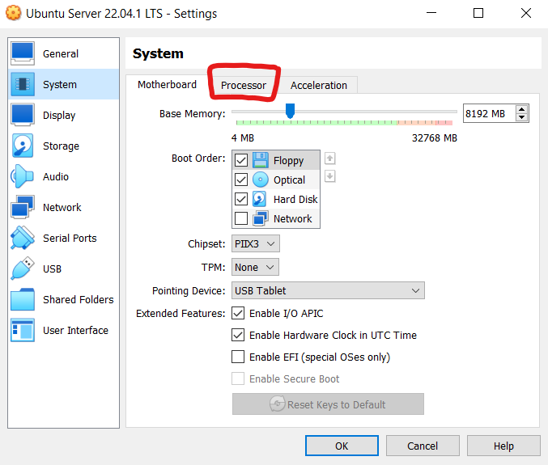

2.4 ไปที่หัวข้อ Extended Features และเลือก Enable PAE/NX ติดถูก

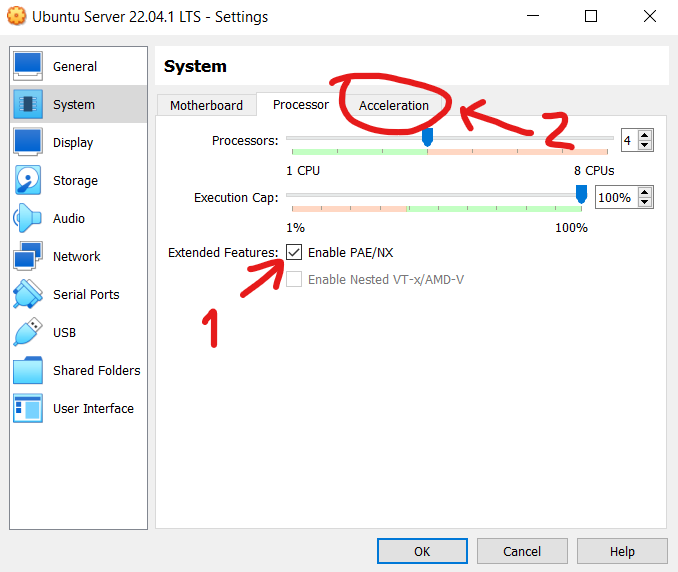

2.5 ไปที่ menu storage และไปที่หัวข้อ Strorage Devices Controller: SATA Ubuntu Server 22.04.1 LTS

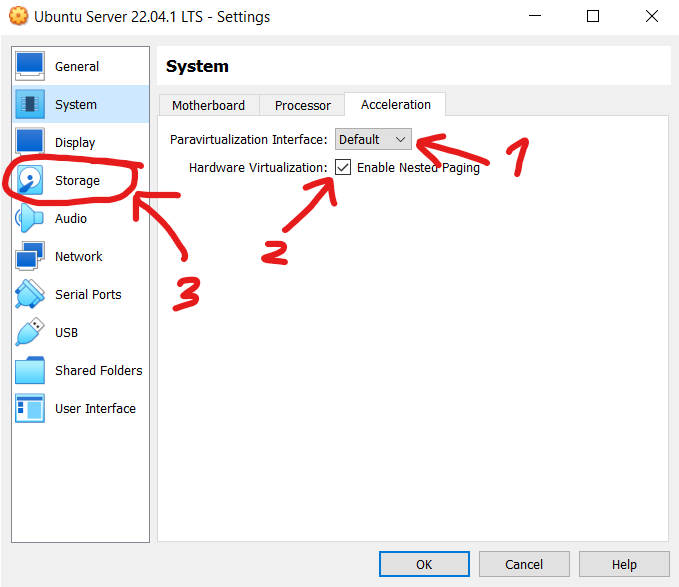

2.6 ไปที่หัวข้อ Attributes ไปที่ Hard Disk เลือกติดถูก Solid State Drive (หากเครื่องเราเป็น SSD หรือไม่ก็ได้)

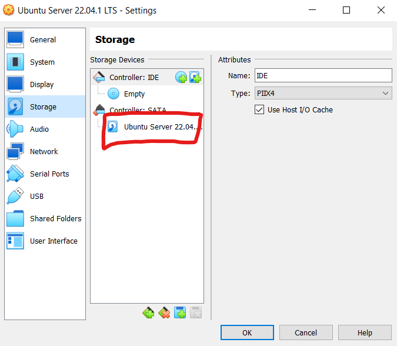

2.7 ไปที่ Menu Network และเลือก Adapter 1 และเลือก Bridged Adapter

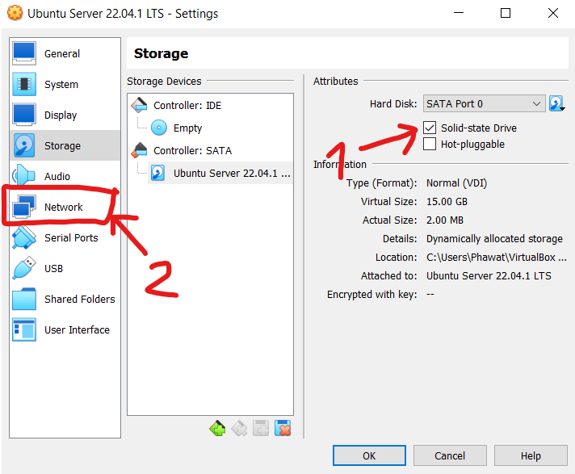

2.8 ไปที่ Adapter 2 

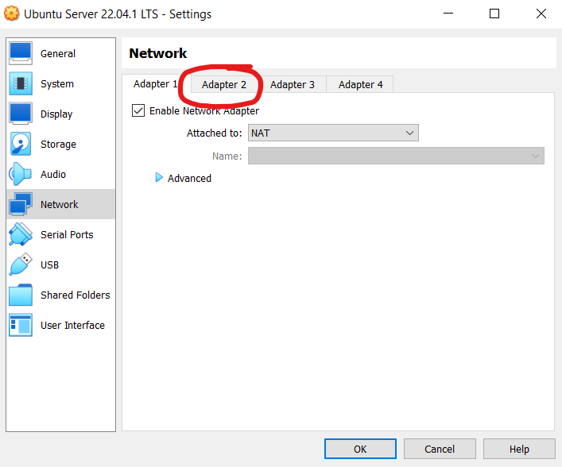

2.9 ติด Enable Network Adapter และเลือก Host-only Adapter และกด OK

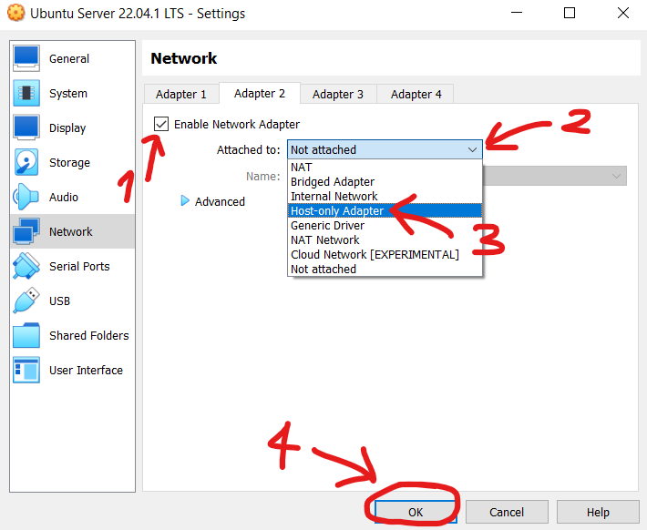
### [(Back) Ubuntu Server 22.04.1 LTS](./Ubuntu%20Server%2022.04.1%20LTS.md)